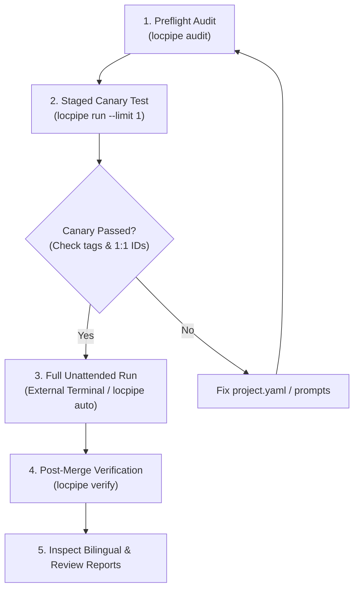

# LLM_GUIDE.md — Operational Manual for AI Agents & Developers

Welcome, Agent. This document is the authoritative engineering manual for operating, extending, and translating with **GameStringer** and **LocPipe**.

LocPipe is a deterministic, LLM-powered video game localization pipeline built on strict separation of concerns:
* **The LLM's only role:** High-fidelity translation of natural language within given context constraints.
* **The Pipeline's role:** File I/O, format parsing, tag masking, deduplication, translation memory (TM), validation, checkpointing, and integrity verification.

---

## 1. Optimal Operational Path for AI Agents

When tasked with localizing a game project under `locpipe/projects/<Project Name>/`, execute the workflow in these sequential stages:



### Stage 1: Preflight Audit (Zero Cost)
Always run audit first to verify extraction and noise filtering without calling any LLMs:
```bash
locpipe audit --project "locpipe/projects/<Project Name>"
```
* Verify kept vs. engine-noise breakdown.
* Ensure dialogue and UI strings are not mistakenly caught in noise filters.

### Stage 2: Staged Canary Test (Mandatory Safety Checkpoint)
Never execute a full unattended run on a new or modified project without a bounded canary test:
```bash
locpipe run --project "locpipe/projects/<Project Name>" --limit 1 --max-api-calls 20
```
* Inspect sample lines (Source → Target).
* Verify 1:1 array index alignment.
* Verify tag and placeholder survival.
* **STOP and report results to the human operator** before proceeding to the full run.

### Stage 3: Full Run Execution (Zero-Touch or External Terminal)
Once approved, execute the full localization run:
* **Autonomous Single Command:**
  ```bash
  locpipe auto --project "locpipe/projects/<Project Name>"
  ```
* **External PowerShell Terminal (Recommended for large runs):**
  Advise the user to run `locpipe run` in an external terminal window to prevent subagent session flooding in IDE conversation transcripts.

### Stage 4: Post-Run Integrity Verification
Prove that non-translatable engine noise and excluded asset paths were completely untouched:
```bash
locpipe verify --project "locpipe/projects/<Project Name>"
```

---

## 2. Production LLM Engine & Future Architecture

### Current Production Engine: Google Gemini 3.8 Flash
In production, GameStringer and LocPipe use **Google Gemini 3.8 Flash** via the hardened Antigravity CLI provider (`antigravity_cli`). Local AI models (such as Ollama, DeepSeek, or Qwen) are **not currently used in active production**.

| Task Role | Model | Effort Level | Batch Size | Rationale |
|---|---|---|---|---|
| **Bulk Batch Translation** | `gemini-3.8-flash` | `effort: low` | `batch_size: 200` | Ultra-fast throughput (~6s/call), wide context window, zero truncation, cost-effective. |
| **Review & Automated Repair** | `gemini-3.8-flash` | `effort: low` (fast/balanced) or `high` (thorough) | `review_batch_size: 25-30` | `low` effort is sufficient for 95% of repairs; `high` is reserved for complex tone/escalation. |

---

### Step-by-Step Pipeline Analysis: Models, Batch Sizes & Token Economy

Understanding which pipeline step consumes tokens and how to optimize each phase:

| Pipeline Step | Tool / Command | LLM Calls & Tokens | Recommended Model & Effort | Batch Size | Optimization Notes |
|---|---|---|---|---|---|
| **1. Extraction & Noise Audit** | `locpipe audit` | **0 tokens (Zero Cost)** | *None (Deterministic)* | N/A | Pure regex & format parsing. Filters binary IDs and engine metadata before LLM ever runs. |
| **2. Pre-flight Planning & TM Check** | `locpipe plan` | **0 tokens (Zero Cost)** | *None (Deterministic)* | N/A | Checks SQLite TM for 100% hits, estimates tokens, verifies font glyphs (ő, ű). |
| **3. Resource Discovery (Optional)** | `locpipe auto-suggest` | **1 LLM call (~2k tokens)** | `gemini-3.8-flash` (`effort: low`) | 40 strings sample | Discovers game genre, suggests style guide preset, and drafts initial glossary terms. |
| **4. Bulk Translation (Phase 1)** | `locpipe run` | **1 call per batch** (~3k-5k tokens) | `gemini-3.8-flash` (`effort: low`) | `batch_size: 200` | **Crucial:** `effort: low` executes in ~6s (vs 12-40s with `high`) with 0 wasted thinking tokens. |
| **5. Tier 1 Mechanical Repair (Phase 2)** | Automatic in pipeline | **0 tokens (Zero Cost)** | *None (Python Code)* | N/A | Repairs unbalanced quotes, accidental whitespace, and regex tag preservation without LLM. |
| **6. Review & Style Repair (Phase 3)** | Automatic in pipeline | **1 call per flagged group** | `gemini-3.8-flash` (`effort: low`) | `review_chunk_size: 30` | Only processes strings with confidence < threshold or missing glossary terms. |
| **7. Escalation Repair (Optional)** | Automatic in pipeline | **Only on persistent failures** | `gemini-3.8-flash` (`effort: high`) | Single string | Final safety net for items failing 2 consecutive review passes. |

---

### Empirical Benchmark: `effort: low` vs. `effort: high`

Empirical testing on real game localization payloads with Gemini 3.8 Flash:

| Metric | `effort: low` (Recommended) | `effort: high` | Impact & Conclusion |
|---|---|---|---|
| **Latency per Call** | **~6.0 seconds** | **12.6 – 40+ seconds** | **2x to 6x faster** throughput with `low`. |
| **Thinking Tokens** | **0 tokens** | **1,000 – 4,000+ tokens** | `low` eliminates unnecessary internal chain-of-thought overhead. |
| **Tag & Variable Preservation** | **100% identical** | **100% identical** | Deterministic syntax rules and `TokenMasker` guarantee tag survival regardless of effort. |
| **Hungarian Grammatical Attachment** | **Accurate** (e.g. `a(z) [SECTOR_ID]`) | **Accurate** (e.g. `a(z) [SECTOR_ID]`) | No measurable grammar advantage for UI/dialogue with `high`. |
| **Recommendation** | **Standard Default for all passes** | **Use only for complex poetry or escalation** | **`effort: low` is the most stable and cost-effective choice.** |

---

### Built-in Speed & Quality Profiles (`project.yaml`)

LocPipe provides 3 built-in profiles in `config.py` that balance speed, token consumption, and review strictness:

| Setting / Feature | `profile: fast` | `profile: balanced` (Recommended Sweet Spot) | `profile: thorough` (Default if omitted) |
|---|---|---|---|
| **Review Threshold** | `0.65` (Fewer review calls) | `0.70` (Balanced threshold) | `0.75` (Strict gating) |
| **Review Chunk Size** | `50` strings | `30` strings | `30` strings |
| **Review Effort** | `effort: low` | `effort: low` | `effort: high` |
| **Fidelity Sample Rate** | `0.0` (Disabled) | `0.01` (1% spot-check) | `0.03` (3% spot-check) |
| **Escalation Pass** | Disabled | Disabled | Enabled (`effort: high`) |
| **Primary Use Case** | Massive text dumps, tight deadlines | **Standard video game & software localization** | High-budget narrative RPGs, poetic lore |

#### Recommended `project.yaml` Configuration for Maximum Speed & Token Efficiency:
```yaml
project: GameName
project_type: game
profile: balanced            # Recommended sweet spot (fastest stable run)
source_lang: en
target_lang: hu
format: uabea_json

provider:
  name: antigravity_cli
  model: gemini-3.8-flash
  effort: low
  review_model: gemini-3.8-flash
  review_effort: low         # Keep low for 3x review speedup
  mode: sync
  max_concurrency: 2         # Prevents API rate limits while maximizing throughput

categories:
  - name: dialogue
    batch_size: 200          # Optimal payload size (safe under 16k output tokens)
  - name: ui
    default: true
    batch_size: 200
```

---

### Future Extensibility: Is Local AI Support Built-In?
**Yes, the architecture is designed from the ground up to support local models in the future.**

The core pipeline (`pipeline.py`, `batcher.py`, `dedupe.py`, `checkpoint.py`, `validators/`) is completely decoupled from any specific LLM vendor. It interacts strictly with an abstract interface defined in `locpipe/src/locpipe/providers/base.py`:

```python
class TranslationProvider(ABC):
    @abstractmethod
    async def complete(
        self,
        system_prompt: str,
        user_payload: str,
        *,
        max_tokens: int,
        effort: Optional[str] = None,
        response_format: str = "json",
    ) -> str:
        """Prompt in, raw JSON string out."""
```

#### How to Add Local AI Models in the Future:
To enable a local model (such as DeepSeek-R1 or Qwen-2.5 running locally in Ollama, LM Studio, or vLLM), only two small steps are required:
1. Implement a new subclass (e.g. `providers/openai_compatible.py`) implementing `complete()` using standard HTTP POST requests to `http://localhost:11434/v1/chat/completions`.
2. Register the provider name in `cli.py` and `config.py`.

All prompt building, engine token masking, retry loops, translation memory caching, format adapters, and post-merge validation will work automatically with zero changes to pipeline code.

---

## 3. Absolute, Non-Negotiable Guardrails

Every AI agent and prompt modification must strictly respect these immutable localization rules:

### Rule 1: Mathematical 1:1 Index Alignment
* The input JSON is an array of objects `[{"id": 0, "source": "..."}, ...]`.
* The output JSON must return an identical array `[{"id": 0, "translation": "..."}, ...]` matching every single ID.
* Never reorder, drop, or concatenate items.

### Rule 2: Absolute Code, Tag & Placeholder Preservation
The following tokens must survive translation **100% byte-identical**:
* **Rich Text & Engine Tags:** `<color=#ff0000>`, `</color>`, `<b>`, `</b>`, `<i>`, `</i>`, `<size=14>`, `<quad ... />`, `<RichText.Bold>`, `<style="Header">`.
* **Printf Specifiers:** `%s`, `%d`, `%f`, `%.2f`, `%02d`, `%lld`, `%zu`, `%X`, `%%`.
* **Bracket Tokens & Controller Glyphs:** `[BTN:L2 ]`, `[BTN:RS ]`, `[player_name]`, `[ITEM_ID]`, `[flag!q]`.
* **Game Markers:** `@primary attack@`, `@aberrations@`.
* **Escape Characters:** `\n` (literal backslash-n), `\r`, `\t`, `\"`.
* **Visual Novel Escape Codes:** `\C[1]`, `\V[2]`, `\I[3]`, `\G`, `\!`.

> [!TIP]
> **Deterministic Token Masking (`TokenMasker`):**
> When working with fragile custom game engines, use `TokenMasker.mask(source)` to replace all engine tokens with immutable sentinels (`⟦T0⟧`, `⟦T1⟧`). After LLM translation, call `TokenMasker.unmask(target, token_map)` to restore original tags with mathematical certainty.

### Rule 3: Target Grammar Attachment on Placeholders
* **Hungarian (`hu`):**
  * When a definite article is required before a placeholder or button glyph, always use `a(z) `:
    * ✅ `a(z) {0}`, `a(z) [BTN:R2 ]-t`
    * ❌ `a {0}`, `az [BTN:R2 ]`
  * Attach case endings with a **hyphen**:
    * ✅ `{item}-t`, `{0}-hoz`, `[BTN:L2 ]-vel`
    * ❌ `{item}t`, `{0}hoz` (corrupts variable delimiter)
* **Japanese (`ja`):**
  * Attach particles naturally after ASCII placeholders: `{0}を`, `{player}の`.
  * Preserve exact half-width ASCII for all tag tokens.

### Rule 4: Anti-Fabrication & Anti-Omission
* Never invent characters, stats, numbers, or details not present in the source string.
* Never omit meaningful source sentences or dialogue beats.
* Do not pad strings with explanatory clauses or disclaimers.

### Rule 5: De-Anglicization of Figurative Idioms
* Never translate English figurative idioms literally word-for-word into the target language.
* Example: `"pull the plug"` → translate as tactical meaning (*"szakítsd meg a kapcsolatot"*, *"állítsd le rögtön"*), NEVER literal *"húzd ki a dugót"*.
* Example: `"carry the world on your shoulders"` → translate as *"nem kell egyedül cipelned a világ terhét"*.

### Rule 6: Avoid Passive Voice in Game UI
* Do not translate English passive notifications (*"detected"*, *"unlocked"*, *"equipped"*) into stiff passive participles (*"-va/-ve észlelve"*).
* Use punchy active verbs or concise nominal statements:
  * ✅ *"Új fegyver elérhető!"* or *"Feloldva!"*
  * ❌ *"Új fegyver fel lett oldva."*

---

## 4. Test Isolation & Environment Cleanliness

* Always execute test runs via `uv run pytest` inside `locpipe/`.
* All test fixtures MUST utilize `tmp_path` for temporary directories and SQLite databases.
* Never commit `.sqlite3` databases, `.draft.md` files, or raw game dumps to Git.
